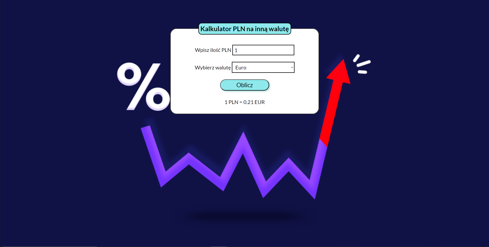

# Currency converter
This is the second project made as a homework during YouCode course. It consists of handling an input from a form and showing expected result, depending on the input values.

## Demo:
https://p-michalski.github.io/currency-converter/

## Tools used:
- HTML
- CSS
- JavaScript

*Project was made using BEM convention.*
